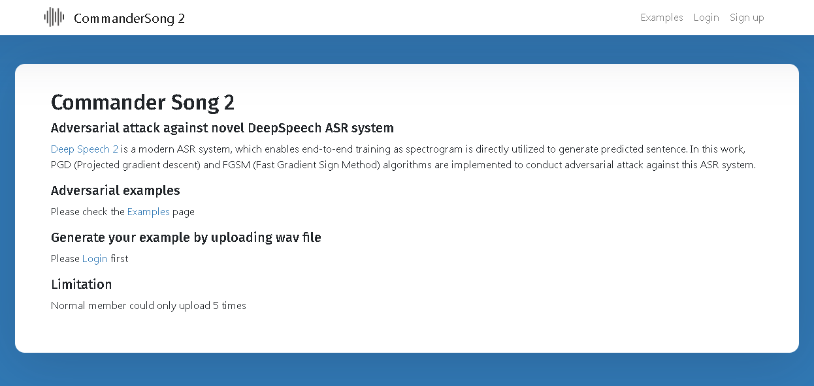

# PyTorch Commander Song 2 React Web Service
A web server for adversarial attack against DeepSpeech2 ASR pytorch model
## Introduction

This repo provide a web service for adversarial sound examples generation against deep speech 2 ASR model. For more attacking technigue information, please refer to this [link](https://github.com/Kaminyou/deepspeech2-pytorch-adversarial-attack), which mainly focuses on how to use PyTorch to generate adversarial examples.

## Setup frontend
The frontend is mainly based on naive `React` and easily to be built up. You must first create a `config.json` file in `frontend/src/config.json/`, which would be like
```json
{
    "SERVER_URL": "backend server url"
}
```
If you setup everything in one server, you can set
```json
{
    "SERVER_URL": "http://127.0.0.1:5002/"
}
```
Then, install all dependencies
```script
cd frontend
yarn
```
Finally, start the fronend server
```script
yarn start
```
## Setup backend
The backend is mainly based on `flask`. To run the backend server, you must first setup several dependencies! Please refer to this [link](https://github.com/Kaminyou/deepspeech2-pytorch-adversarial-attack) to install `deepspeech.pytorch` first. Also, it is recommended to run this project on Anaconda environment with PyTorch installation. Besides, you **MUST have GPU** on your server to make sure all the process would run appropriately.</br>
0. Prepare Pytorch and Anaconda environment
1. STEP 1: Install deepspeech environment (please do these steps in root path). That's, make the structure like:
```
this_repo/
├── frontend/
│   └──...
├── backend/
│   ├──server.py
│   └──...
├──deepspeech.pytorch/
│   ├──models/
│   │   └──librispeech/
│   │       └──librispeech_pretrained_v2.pth
│   └──...
```
Please run the following code to setup the backend environment
```script
git clone https://github.com/SeanNaren/warp-ctc.git
cd warp-ctc; mkdir build; cd build; cmake ..; make
export CUDA_HOME="/usr/local/cuda"
cd ../pytorch_binding && python setup.py install

git clone --recursive https://github.com/NVIDIA/apex.git
cd apex && pip install .

git clone --recursive https://github.com/parlance/ctcdecode.git
cd ctcdecode && pip install .

git clone https://github.com/SeanNaren/deepspeech.pytorch.git
cd deepspeech.pytorch
pip install -r requirements.txt
```
2. Download the pretrained model
```
cd deepspeech.pytorch
mkdir models
cd models
mkdir librispeech
cd librispeech
wget -O librispeech_pretrained_v2.pth https://github.com/SeanNaren/deepspeech.pytorch/releases/download/v2.0/librispeech_pretrained_v2.pth
```
Afterward, two secret files should be created.
1. backend/args.py
```python
class Args(object):
    def __init__(self):
        self.model_path = "/path_to_the_model/librispeech_pretrained_v2.pth"
        self.device = "cuda"

```
2. backend/utils/secret.py
```python
class Secret(object):
    def __init__(self):
        self.account = "admin"
        self.password = "set_admin_password"
        self.level = "admin"
        self.gift = "secret_token_for_invited_user"
```
You can delete the existing database in `backend/sqlite_db/adv_sound.sqlite` cause you would never know the password. Then, initilize the new database by
```script
python3 init_db.py
```
Now, everything is prepared. The backend server can be easily run by
```script
python3 server.py
```

# Report part
### Deployed Link：
(temp http://server.cmdm.tw:3000/) However, VPN is required for accessing the backend server and would not be released because this service utilizes GPU computing resource.
### Demo Video:
https://youtu.be/zaZ4g7hPcEw
### Introduction:
This web service allows clients to easily upload their wav. file and embed adversarial command in it (e.g. OK GOOGLE or HEY SIRI) to conduct white-box targeted attack against Deep Speech 2 ASR model. The recognition results and Levenshtein distance will be shown after generation, and clients can conveniently download them by the links provided.
### Usage:
Please refer to the instruction provided in Github link to setup all environment. The frontend is mainly based on React while the backend is based on Flask. However, for the adversarial examples generation, several packages like PyTorch, Torchaudio, pytorch.deepspeech, and apex should be installed first. Please note that it is arduous to prepare this environment on your GPU machine.
Finally, for the usage, please refer to the video. Client must login first or sign up with a secret invitation token. Also, the passwords are saved after SHA256 hash function, so it is ineffective to guest admin’s password even the database is provided in the Github. After log-in, it is easy to upload your wav file in GENERATE page and see or download the results in RESULTS page. Please mind that if you sign up as “member”, you can only upload for 5 times, while “admin” has no limitation.
### Github link:
https://github.com/Kaminyou/pytorch-commandersong2-react-web
### Other notes:
You can choose either PGD or FGSM algorithm with adjustable ε, α , and iteration times to generate your adversarial examples. Please note that different setting would greatly affect the generation quality! Also, the pytorch CTC Loss function is substituted for the original loss function, warp-ctc loss, utilized in deepspeech model training.
### Reference:
FRONTEND: React, Bootstrap, documents and multifarious articles in Stack Overflow.
BACKEND: DeepSpeech2.pytorch and STFT(short-time Fourier transform) algorithm in pytorch version (https://github.com/pseeth/torch-stft) to allow gradient propagation to raw wave form.
### Learning experience:
I am glad to be able to finish this project in time and this might be the first web service providing sound-related adversarial examples generation! Actually, the most arduous task is solving several problems caused by Cross-Origin Resource Sharing (CORS) to allow clients to upload their wav. files and download after finishing computation. Also, I endeavored for a long time to enable python to conduct jobs asynchronously to overcome the time-consuming task of adversarial example generation especially using PGD algorithm. Besides, it is extremely hard to deliver files in “correct” format between service and several trivial settings are required. Overall, it is a great experience for me to finish my first full stack project.
### Third Party Packages:
##### DATABASE
- SQLite3
##### FRONTEND (JS)
- React
- React-router
- Axios
- Material-UI
- Material-Table
- Bootstrap
##### BACKEND (Python)
- Flask
- CORS
- Librosa
- PyTorch
- Torchaudio
- Levenshtein
- Hashlib
- Deepspeech.pytorch
- Apex
- Warp-ctc
### Contribution
MING-YANG, HO (r08945027) contribute for all this project including fronend, backend, and UI design.

### Misc.
This project is a web service version of my previous project ([link](https://github.com/Kaminyou/deepspeech2-pytorch-adversarial-attack)).